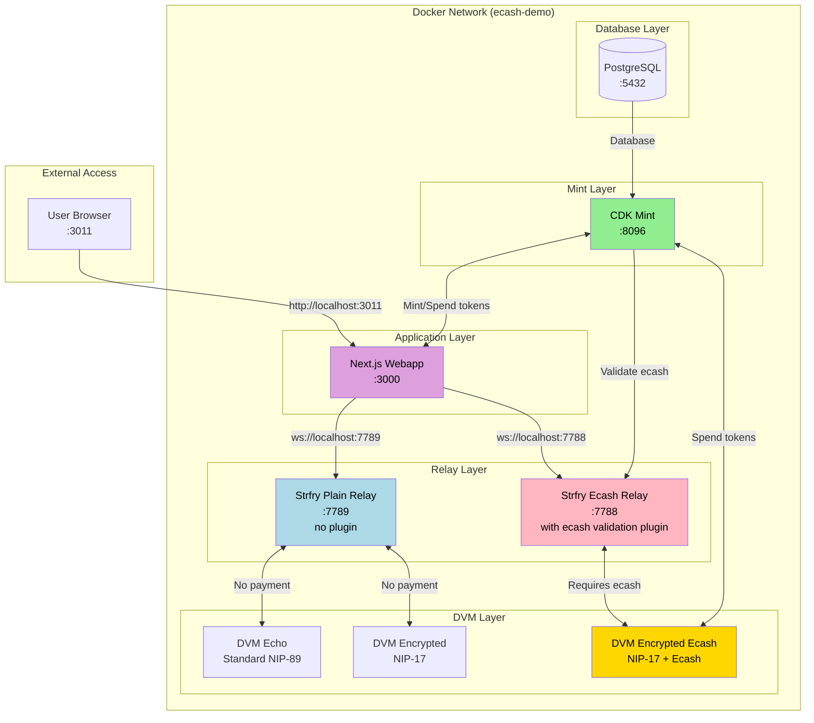

# Strfry Ecash Plugin DVM Demo

A proof-of-concept implementation demonstrating ecash-based rate-limiting for Nostr Data Vending Machine (DVM) communications using encrypted NIP-17 messages. This project showcases how Cashu ecash can be integrated with Strfry relays to create payment-gated access to DVM services.

## Overview

This demo implements a complete ecash payment system for Nostr DVMs, including:
- Cashu ecash mint for issuing tokens
- Custom Strfry relay plugin for validating and consuming ecash
- Multiple DVMs so we can compare performance tradeoffs of adding encryption and ecash validation
  - A plaintext DVM with no encryption or ecash, everything is visible to the relay
  - An encrypted DVM using NIP-17 that relies on the goodwill of public relays to broadcast gift wrapped notes signed by random npubs
  - An encrypted DVM also using NIP-17 that attaches ecash to pay the relay for each note
- Web interface for minting tokens and performance testing

## Architecture



## Quick Start

### Prerequisites
- Docker and Docker Compose
- Git

### Running the Project

1. Clone the repository:
```bash
git clone https://github.com/dtdannen/strfry-ecash-plugin-dvm-demo.git
cd strfry-ecash-plugin-dvm-demo
```

2. Start all services:
```bash
docker compose up
```

3. Access the webapp at [http://localhost:3011](http://localhost:3011)

The system will automatically:
- Initialize the PostgreSQL database
- Start the CDK Cashu mint
- Launch both Strfry relays (with and without ecash validation)
- Start all three DVMs
- Serve the Next.js webapp

### Stopping the Project

```bash
docker compose down
```

To remove all data volumes:
```bash
docker compose down -v
```

## Components

### 1. PostgreSQL Database (`postgres`)
- **Port**: 5443 (external) → 5432 (internal)
- **Purpose**: Persistent storage for the CDK mint
- **Credentials**: `mint/mint_password_change_in_production`

### 2. CDK Cashu Mint (`cdk-mint`)
- **Port**: 8096
- **Purpose**: Issues and validates Cashu ecash tokens
- **Technology**: [Cashu Development Kit (CDK)](https://github.com/cashubtc/cdk)
- **Configuration**: `config.toml`
- **Note**: We found a race condition in CDK so you need to make sure to use this [fork of CDK](https://github.com/dtdannen/cdk) until a PR gets merged

### 3. Strfry Ecash Relay (`strfry-ecash`)
- **Port**: 7788
- **Purpose**: Nostr relay with ecash validation plugin
- **Features**:
  - Validates ecash tokens in event tags
  - Consumes (spends) valid tokens with the mint
  - Rejects events without valid payment
- **Plugin**: Custom Python plugin in `strfry/plugins/`

### 4. Strfry Plain Relay (`strfry-plain`)
- **Port**: 7789
- **Purpose**: Standard Nostr relay without payment requirements
- **Use Case**: Baseline performance comparison

### 5. Next.js Webapp (`webapp`)
- **Port**: 3011
- **Purpose**: User interface for:
  - Minting ecash tokens
  - Testing token spend operations
  - Running performance benchmarks
  - Comparing ecash vs non-ecash DVM performance
- **Technology**: Next.js 14, React, TypeScript, Tailwind CSS

### 6. DVM Echo (`dvm-echo`)
- **Purpose**: Basic echo DVM as detailed [here](https://habla.news/a/naddr1qvzqqqr4gupzpkscaxrqqs8nhaynsahuz6c6jy4wtfhkl2x4zkwrmc4cyvaqmxz3qqxnzde4xscrzwpexyerzdes85ynm8)
- **Relay**: Default Strfry relay (no payment required)
- **Response**: Returns the input message

### 7. DVM Encrypted (`dvm-encrypted`)
- **Purpose**: DVM using NIP-17 encrypted direct messages
- **Relay**: Default Strfry relay (no payment required)
- **Response**: Encrypted echo response

### 8. DVM Encrypted Ecash (`dvm-encrypted-ecash`)
- **Purpose**: DVM using NIP-17 with ecash payment requirement
- **Relay**: Strfry relay with ecash validation plugin (payment required)
- **Cost**: 1 sat per request
- **Response**: Encrypted echo response after payment validation

## Usage

### Web Interface

The webapp provides two main pages:

#### 1. Ecash Mint Testing (`/`)


Features:
- **Mint Tokens**: Create 1-sat ecash tokens
- **Spend Tokens**: Validate and redeem tokens
- **Performance Testing**: Batch mint/spend operations
  - Test with 10 to 1,000,000 tokens
  - Real-time progress tracking
  - Performance metrics (throughput, latency)

#### 2. DVM Performance Tester (`/dvm-tester`)


Features:
- Side-by-side comparison of three DVM types:
  - Standard (NIP-89)
  - Encrypted (NIP-17)
  - Encrypted + Ecash (NIP-17 + payment)
- Batch testing (10-1000 requests)
- Sequential and parallel execution modes
- Configurable parallel request delays
- Real-time metrics:
  - Throughput (requests/second)
  - Round-trip time (median, average, P95, mode)
  - Success/failure tracking

### Performance Testing

The project includes performance analysis scripts in `scripts/`:

- **`plot_performance.py`**: Visualizes DVM performance metrics
- **`measure_token_size.py`**: Analyzes ecash token sizes

Run with:
```bash
python scripts/plot_performance.py
```

Results are saved to the `output/` directory.

## Development

### Project Structure
```
.
├── cdk/                    # CDK mint source (submodule)
├── config.toml             # Mint configuration
├── data/                   # Test results and data
├── dvm/                    # Standard echo DVM
├── encrypted_dvm/          # NIP-17 encrypted DVM
├── encrypted_ecash_dvm/    # NIP-17 + ecash DVM
├── output/                 # Performance charts and analysis
├── scripts/                # Analysis and testing scripts
├── screenshots/            # Documentation screenshots
├── strfry/                 # Strfry relay configuration
│   └── plugins/            # Custom ecash validation plugin
├── webapp/                 # Next.js frontend application
└── docker-compose.yml      # Service orchestration
```

### Key Files
- `strfry/plugins/ecash_plugin.py`: Ecash validation logic
- `webapp/app/page.tsx`: Mint testing interface
- `webapp/app/dvm-tester/page.tsx`: DVM performance tester
- `test_ecash_plugin.py`: Plugin unit tests

### Environment Variables

DVM keys and relay URLs are configured in `docker-compose.yml`. For production use, generate new keys and update the configuration.

## Performance Results

Preliminary testing shows:
- **Ecash validation overhead**: ~10-20ms per request
- **Throughput**: 10-30 requests/second (with ecash validation)
- **Token operations**: 100+ mints/spends per second

Detailed results are available in `data/results_24OCT2025.txt`.

## License

This project is licensed under the MIT License - see the [LICENSE](LICENSE) file for details.

## Related Projects

- [Cashu Development Kit (CDK)](https://github.com/cashubtc/cdk)
- [Strfry Relay](https://github.com/hoytech/strfry)
- [Cashu TS Library](https://github.com/cashubtc/cashu-ts)

## Contributing

This is a proof-of-concept project. Contributions and feedback are welcome via issues and pull requests.
